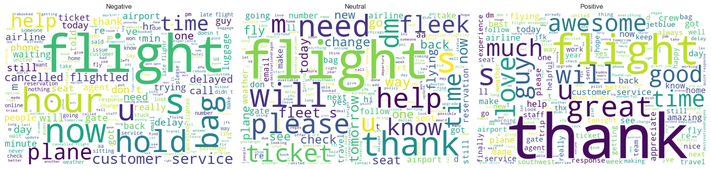
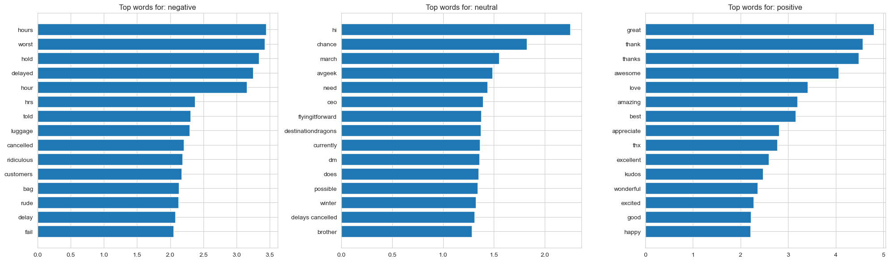

# Airline Customer Sentiment Analysis


Classifying sentiment in ~14,600 tweets about US airlines, and diagnosing what specifically
drives negative sentiment.

**Author:** [Bhargavi Anupati](https://github.com/BhargaviAnupati) · [LinkedIn](https://www.linkedin.com/in/bhargavi-r-9667b4231/)

## Results at a Glance

**Logistic Regression on TF-IDF features achieved 0.706 macro F1**, outperforming both Naive
Bayes and XGBoost — the simplest model held its own, echoing a pattern also seen in this
portfolio's diabetes risk project. US Airways had the worst sentiment (77.7% negative tweets)
and Customer Service Issue was the single largest driver of complaints across nearly every
airline.

| Word clouds by sentiment | Top predictive words per class |
|---|---|
|  |  |


## Table of Contents
- [Results at a Glance](#results-at-a-glance)
- [Project Overview](#project-overview)
- [Dataset](#dataset)
- [Methods](#methods)
- [Tech Stack](#tech-stack)
- [Project Structure](#project-structure)
- [How to Run](#how-to-run)
- [Key Takeaways](#key-takeaways)
- [Model Performance](#model-performance)
- [Limitations](#limitations)
- [Next Steps](#next-steps)
- [Author](#author)

## Project Overview

**Business question:** What do people say about US airlines on social media, which airlines
have the worst sentiment, and what specific issues (late flights, rude service, lost baggage,
etc.) drive negative tweets?

This is this portfolio's first **NLP / text classification** project — a deliberate skill
addition alongside the tabular classification (diabetes risk) and panel/time-series forecasting
(Rossmann) projects already in this portfolio.

## Dataset

- **Source:** [Twitter US Airline Sentiment — Kaggle](https://www.kaggle.com/datasets/crowdflower/twitter-airline-sentiment)
  (also mirrored on [Hugging Face](https://huggingface.co/datasets/osanseviero/twitter-airline-sentiment),
  which can be loaded without a Kaggle account)
- **Size:** 14,640 tweets from ~7,700 users, scraped February 2015
- **Key fields:**
  - `text` — the tweet
  - `airline_sentiment` — positive / neutral / negative (target)
  - `negativereason` — category of complaint, only populated for negative tweets
  - `airline` — which of 6 major US airlines the tweet concerns
- **Known data quality notes:**
  - Roughly 60% of tweets are negative — meaningful class imbalance
  - Raw tweet text includes @mentions, URLs, and HTML entities that need cleaning

## Methods

1. **Data Loading** ✅
2. **Text Cleaning** ✅ — stripped @mentions, URLs, HTML entities; lowercased
3. **Exploratory Data Analysis** ✅ — sentiment distribution, sentiment by airline,
   negative reason breakdown, tweet length, word frequency by class
4. **Feature Engineering** ✅ — TF-IDF vectorization (unigrams + bigrams, 5,000 features)
5. **Train/Test Split** ✅ — stratified 80/20, preserving class imbalance
6. **Modeling** ✅ — compared Logistic Regression, Naive Bayes, and XGBoost on TF-IDF features
7. **Evaluation** ✅ — macro-F1, per-class precision/recall, confusion matrix, and most
   predictive words per class
8. **Interpretation** — planned — top predictive words per class; negative reasons by airline

## Tech Stack

| Category | Tools |
|---|---|
| Language | Python |
| Data handling | pandas, numpy (`<2`) |
| Text processing | re (regex), NLTK or spaCy (optional), scikit-learn TF-IDF |
| Visualization | matplotlib, seaborn, wordcloud |
| Modeling | scikit-learn, XGBoost |
| Deployment | Streamlit |
| Environment | Jupyter Lab |

## Project Structure

```
airline-sentiment-analysis/
├── README.md
├── requirements.txt
├── data/                                     # Tweets.csv (download instructions below)
├── notebooks/
│   ├── 01_data_loading_and_eda.ipynb                ✅ complete
│   ├── 02_text_preprocessing_and_baseline.ipynb     ✅ complete
│   ├── 03_model_comparison_and_evaluation.ipynb      ✅ complete
│   └── 04_interpretation_and_negative_reasons.ipynb
├── src/                                      # reusable functions
├── app/                                      # Streamlit sentiment demo
└── reports/                                  # exported figures
```

## How to Run

```bash
# Clone the repo
git clone https://github.com/BhargaviAnupati/airline-sentiment-analysis.git
cd airline-sentiment-analysis

# Install dependencies
pip install -r requirements.txt

# Get the data (pick one):
#   Option A: download Tweets.csv from Kaggle into data/
#   Option B: load directly from Hugging Face inside the notebook (see notebook 01)

jupyter lab notebooks/01_data_loading_and_eda.ipynb
```

## Key Takeaways

- Of 14,640 tweets, **62.7% were negative**, 21.2% neutral, and 16.1% positive — a substantial
  class imbalance that shapes the evaluation approach for modeling (accuracy alone won't be a
  reliable metric).
- **US Airways had the worst sentiment** (77.7% of its tweets negative) and **Virgin America the
  best** (35.9% negative), even after normalizing for tweet volume — this isn't just a "bigger
  airline gets more complaints" artifact.
- **Customer Service Issue was the single largest driver of negative sentiment** (2,910 tweets),
  well ahead of Late Flight (1,665) and Cancelled Flight (847). It was the #1 complaint for
  every airline except Delta, where Late Flight topped the list instead.
- Word clouds by sentiment class showed a clear pattern: negative tweets centered on operational
  pain points (hold, delayed, cancelled, luggage), while positive tweets centered on gratitude
  language (thank, awesome, great) — a good sanity check that the labels make intuitive sense
  before any modeling begins.
- A Logistic Regression baseline on TF-IDF features (unigrams + bigrams) achieved **macro F1 of
  0.706** (75% accuracy). Performance was strongest on the negative class (F1 0.83) and weakest
  on neutral (F1 0.60) — an expected pattern, since neutral tweets sit in a "messy middle" with
  less distinctive vocabulary than clearly positive or negative language.
- Reviewing misclassified tweets revealed a genuine limitation of the bag-of-words approach:
  **TF-IDF has no mechanism for detecting sarcasm or negation context.** For example, "thanks
  for updating me about the hour delay" (labeled positive, predicted negative) and "I've never
  had anything bad to say until now" (labeled negative, predicted positive) both confused the
  model because it sees individual positive/negative words without understanding tone or the
  sentence-level twist that flips their meaning.
- **Logistic Regression outperformed both Naive Bayes and XGBoost** (macro F1 0.706 vs. 0.573
  and 0.627), the same "simpler model holds its own" pattern seen in the diabetes project.
  Naive Bayes struggled most on minority classes (neutral recall 0.24, positive recall 0.39)
  since it lacks a class-weighting mechanism; XGBoost also underperformed on neutral recall
  (0.28), likely because it wasn't given explicit imbalance handling in this pass.
- The most predictive words per class mostly matched intuition — negative dominated by
  operational complaints (hours, worst, hold, delayed, luggage, cancelled, rude), positive by
  gratitude/praise (great, thank, awesome, love, amazing). The neutral class was a more
  interesting finding: its top words (hi, chance, avgeek, flyingitforward, destinationdragons)
  looked more like campaign hashtags and generic greetings than "emotionally neutral" language —
  suggesting neutral tweets are less about muted sentiment and more about questions, mentions,
  and promotional engagement that simply don't express clear sentiment either way.

## Model Performance

| Model | Macro F1 | Accuracy |
|---|---|---|
| Logistic Regression (TF-IDF) | **0.706** | 0.751 |
| Naive Bayes (TF-IDF) | 0.573 | 0.727 |
| XGBoost (TF-IDF) | 0.627 | 0.741 |

**Selected model: Logistic Regression.** Despite being the simplest of the three, it achieved
the highest macro F1 — echoing the same pattern seen in the diabetes project, where added model
complexity didn't automatically translate to better performance. Note this isn't a perfectly
apples-to-apples comparison: Naive Bayes has no built-in class-weighting mechanism, and XGBoost
wasn't given explicit imbalance handling in this pass (a natural next step would be adding
`sample_weight` to XGBoost and re-testing).

## Limitations

- Tweets are from February 2015 only — sentiment patterns and airline service quality may have
  changed significantly since then.
- Twitter/X users skew toward a particular demographic and are more likely to tweet about
  negative experiences than positive ones, so this isn't a representative sample of all
  customers, just of who chooses to post publicly.
- `negativereason` is self-selected by the original annotators, not the tweet author, so it
  reflects an interpretation of the complaint rather than the author's own categorization.

## Next Steps

- [x] Complete data loading, cleaning, and EDA
- [x] Build TF-IDF features and baseline model
- [x] Compare additional models
- [x] Evaluate and interpret results
- [ ] Optional: build Streamlit sentiment-checker demo
- [ ] Write up plain-English summary

## Author

**Bhargavi Anupati**
[LinkedIn](https://www.linkedin.com/in/bhargavi-r-9667b4231/) · [GitHub](https://github.com/BhargaviAnupati)

## License

This project is licensed under the [MIT License](LICENSE).
