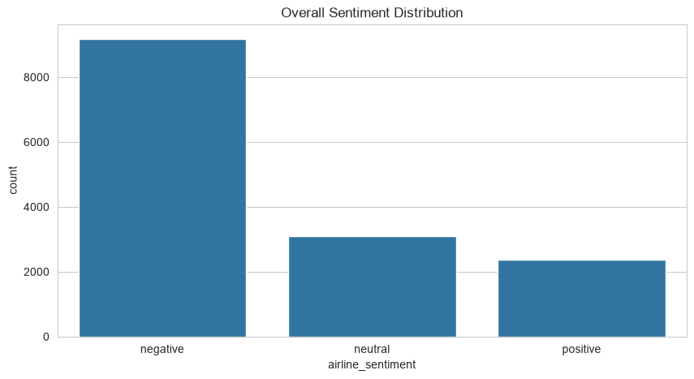
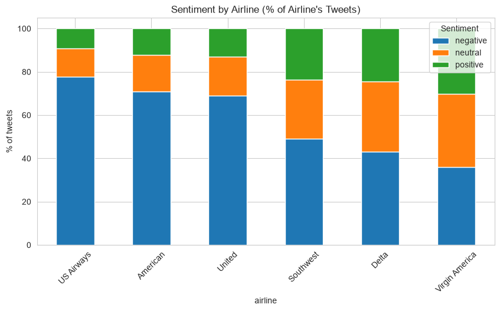
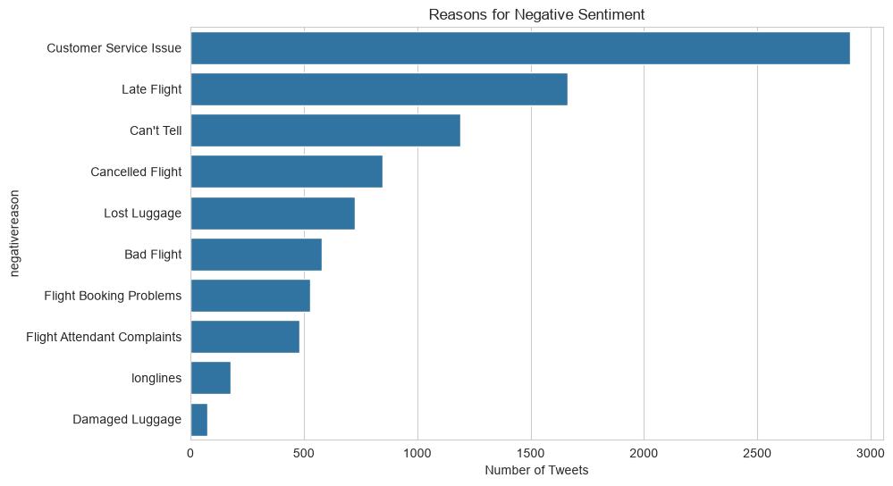
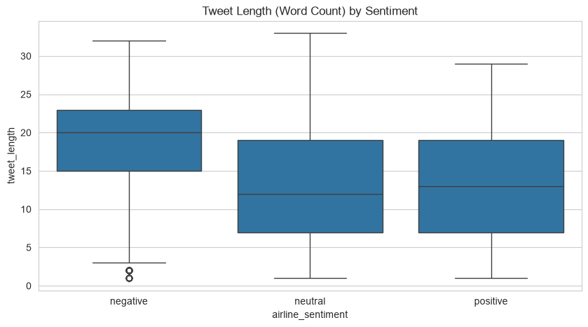
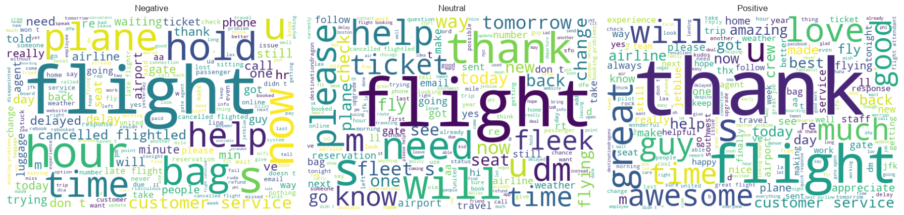
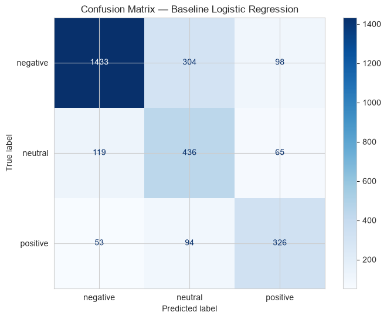
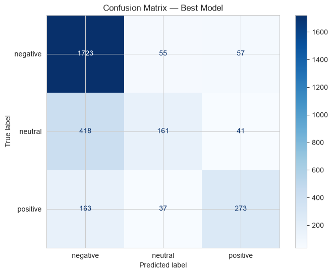
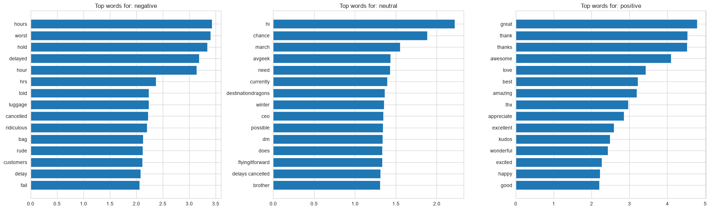

# Airline Customer Sentiment Analysis — Final Report

**Author:** Bhargavi Anupati
**Dataset:** Twitter US Airline Sentiment (14,640 tweets, February 2015, 6 US airlines)
**Notebooks:** [`01_data_loading_and_eda.ipynb`](../notebooks/01_data_loading_and_eda.ipynb) · [`02_text_preprocessing_and_baseline.ipynb`](../notebooks/02_text_preprocessing_and_baseline.ipynb) · [`03_model_comparison_and_evaluation.ipynb`](../notebooks/03_model_comparison_and_evaluation.ipynb)

---

## 1. Problem Statement

Airlines generate a large volume of unsolicited customer feedback on social
media every day. Two questions matter for a customer-experience team trying
to use that signal:

1. **Can tweet text alone reliably classify customer sentiment** (negative / neutral / positive) well enough to triage incoming mentions automatically?
2. **What specifically is driving negative sentiment** — which complaints show up most, and do they differ by airline?

## 2. Data

- **Source:** [Twitter US Airline Sentiment](https://www.kaggle.com/datasets/crowdflower/twitter-airline-sentiment), 14,640 tweets from February 2015 mentioning one of 6 US airlines (Virgin America, United, Southwest, Delta, US Airways, American).
- **Target:** `airline_sentiment` — a 3-class, meaningfully imbalanced target: **negative 62.7%**, **neutral 21.2%**, **positive 16.1%**.
- **Text cleaning:** @mentions, URLs, HTML entities, and punctuation/numbers stripped, then lowercased (e.g. `"@VirginAmerica What @dhepburn said."` → `"what said"`). Full schema in [`data/README.md`](../data/README.md).

### Sentiment varies a lot by airline

Looking at each airline's *own* mix of sentiment (not raw counts, which are
skewed by how much each airline is discussed) reveals a wide spread — from
US Airways at 77.7% negative to Virgin America at just 35.9% negative:

| Airline | % Negative | % Neutral | % Positive |
|---|---|---|---|
| US Airways | 77.7% | 13.1% | 9.2% |
| American | 71.0% | 16.8% | 12.2% |
| United | 68.9% | 18.2% | 12.9% |
| Southwest | 49.0% | 27.4% | 23.6% |
| Delta | 43.0% | 32.5% | 24.5% |
| Virgin America | 35.9% | 33.9% | 30.2% |

### What's actually driving negative sentiment

**Customer Service Issue** is the single largest reason (2,910 tweets),
followed by **Late Flight** (1,665), "**Can't Tell**" — genuinely ambiguous
complaints (1,190) — **Cancelled Flight** (847), and **Lost Luggage** (724).
Breaking this down per airline, **Customer Service Issue is the top
complaint for 5 of the 6 airlines** — the exception is Delta, where **Late
Flight** is the single biggest driver of negative sentiment. This is a
concrete, airline-specific finding: a generic "improve customer service"
recommendation would miss Delta's actual biggest lever.

### Tweet length and vocabulary by sentiment

Even before any modeling, the word clouds hint at what a text classifier
will pick up on: negative tweets cluster around delay/service vocabulary
("hours," "delayed," "cancelled," "hold"), positive tweets around
gratitude/praise vocabulary ("thanks," "great," "awesome," "love").

## 3. Methodology

### 3.1 Train/test split

A stratified 80/20 split (`random_state=42`) preserves the 62.7/21.2/16.1
class balance in both sets:

- Train: 11,712 tweets
- Test: 2,928 tweets

### 3.2 Feature engineering: TF-IDF

Tweet text was vectorized with TF-IDF (`TfidfVectorizer`), **fit on the
training set only** and applied to both splits to avoid leakage:

- `max_features=5000` — caps vocabulary size for speed.
- `min_df=3` — drops extremely rare terms (more noise than signal).
- `ngram_range=(1, 2)` — includes both single words and two-word phrases (e.g. `"customer service"`, `"minute hold"`), which capture useful multi-word complaints a unigram-only model would miss.
- `stop_words='english'` — removes common English stop words.

Resulting training matrix: 11,712 × 5,000 (sparse).

### 3.3 Handling class imbalance

- **Logistic Regression:** `class_weight='balanced'`.
- **Naive Bayes:** no native support for class weighting — trained as-is, which turns out to matter a great deal (Section 4).
- **XGBoost:** trained without explicit class-imbalance handling in this version (no `sample_weight` or per-class weighting applied); a natural improvement to try next.

### 3.4 Models compared

| Model | Key configuration |
|---|---|
| Logistic Regression (baseline) | `class_weight='balanced'`, `max_iter=1000` |
| Multinomial Naive Bayes | Default parameters (no class weighting) |
| XGBoost | `n_estimators=300`, `max_depth=6`, `learning_rate=0.1`, `objective='multi:softmax'` |

## 4. Results

Because the target is imbalanced (62.7% negative), **macro F1** — the
unweighted average of each class's F1 score — is the metric that matters
most here: it treats getting "neutral" and "positive" right just as
seriously as "negative," where plain accuracy would let a model coast by
mostly predicting the majority class.

| Model | Macro F1 | Accuracy |
|---|---|---|
| **Logistic Regression** | **0.704** | 0.750 |
| XGBoost | 0.616 | 0.737 |
| Naive Bayes | 0.577 | 0.729 |

**Accuracy alone barely distinguishes the three models** (0.729–0.750), but
**macro F1 clearly separates them** — because Logistic Regression is
dramatically better at the two minority classes:

| Model | Negative F1 | Neutral F1 | Positive F1 |
|---|---|---|---|
| Logistic Regression | 0.83 | **0.60** | **0.68** |
| XGBoost | 0.83 | 0.37 | 0.65 |
| Naive Bayes | 0.83 | 0.36 | 0.54 |

All three models are equally good at spotting the majority "negative"
class (F1 ≈ 0.83) — the real gap is on "neutral," where the
`class_weight='balanced'` Logistic Regression nearly doubles the other two
models' F1 score. This is a direct, visible consequence of Section 3.3:
Naive Bayes has no class-weighting mechanism at all, and this version of
XGBoost wasn't given one either, so both models default toward the majority
class more than Logistic Regression does.

**Final model: Logistic Regression**, selected for its clearly superior
macro F1, its ability to handle class imbalance natively via
`class_weight='balanced'`, and its directly interpretable coefficients
(Section 5) — a meaningful advantage over XGBoost for a text-classification
use case where understanding *why* matters as much as raw accuracy.

For comparison, XGBoost's confusion matrix shows the same pattern
numerically — strong on "negative," visibly weaker at recalling "neutral"
tweets (many get pulled into "negative"):

### Reading the errors

733 of 2,928 test tweets (25.0%) were misclassified. The most interesting
errors — a "negative" tweet predicted "positive," or vice versa — are
overwhelmingly cases of **sarcasm, mixed sentiment, or a positive detail
mentioned inside an overall complaint**, e.g.:

> *"stellar customer service you have earned my bu[siness]..."* — labeled **positive**, predicted **negative** (reads sarcastic, but the labeler read it as sincere praise)
>
> *"we appreciate the shoutout for roberto dm conf..."* — labeled **negative**, predicted **positive** (contains "appreciate," but the full context is a complaint)

This is a known, hard limitation of bag-of-words/TF-IDF style features:
individual sentiment-coded words ("appreciate," "thanks") can mislead the
model when the surrounding context flips their meaning — something a
model with more context (e.g. a transformer-based sentence embedding) would
likely handle better.

## 5. Word-Level Interpretation

Using the final Logistic Regression model's coefficients (its one-vs-rest
weights per class are directly interpretable, unlike XGBoost's or Naive
Bayes'), the terms that most strongly push a prediction toward each
sentiment class are:

- **Negative:** `hours`, `worst`, `hold`, `delayed`, `hour`, `hrs`, `told`, `luggage`, `cancelled`, `ridiculous`, `bag`, `rude` — almost entirely operational failure and service-quality language, consistent with the negative-reason breakdown in Section 2.
- **Positive:** `great`, `thank`, `thanks`, `awesome`, `love`, `best`, `amazing`, `thx`, `appreciate`, `excellent`, `kudos`, `wonderful` — overwhelmingly gratitude and praise vocabulary.
- **Neutral:** a noticeably less coherent list (`hi`, `chance`, `march`, `avgeek`, `need`, `currently`, `destinationdragons`) — reflecting that "neutral" tweets are often genuinely ambiguous, informational, or off-topic mentions rather than a distinct sentiment vocabulary of their own. This lines up with "neutral" being the hardest class for every model in Section 4.

## 6. Limitations

- **Bag-of-words features miss context and sarcasm.** As shown in Section 4's error analysis, TF-IDF has no way to represent negation scope, sarcasm, or a positive word used inside a negative sentence. A transformer-based approach (e.g. a fine-tuned BERT-family model) would likely close much of this gap.
- **XGBoost and Naive Bayes were not given class-imbalance handling** in this version (Naive Bayes has no native mechanism for it; XGBoost wasn't configured with one either) — this substantially explains their much weaker "neutral" F1 relative to Logistic Regression, and isn't a fully fair apples-to-apples comparison of "model architecture" in isolation. Retrying XGBoost with `sample_weight` or a focal-loss-style objective is a natural next step before concluding Logistic Regression is architecturally superior for this task.
- **A single point in time.** All tweets are from February 2015; airline service quality, social media behavior, and even airline mergers since then (e.g. American/US Airways) mean these specific findings may not hold today.
- **Sentiment labels come from a single crowdsourced pass**, not multiple annotators reconciled — some of the misclassifications in Section 4 may reflect debatable ground-truth labels (the "stellar customer service" example) as much as model error.

## 7. Conclusion

A TF-IDF + Logistic Regression pipeline classifies airline sentiment with a
macro F1 of 0.704, clearly outperforming both Naive Bayes (0.577) and
XGBoost (0.616) on this metric — a case where the simpler, properly
class-weighted model beats more complex alternatives, echoing a pattern
also seen in this author's diabetes-risk project. Beyond classification
accuracy, the analysis surfaces two directly actionable findings: **customer
service, not flight delays, is the leading driver of negative sentiment for
5 of the 6 airlines** (Delta is the exception, where late flights dominate),
and the model's own learned vocabulary — operational-failure words for
negative, gratitude words for positive — confirms it's picking up genuine
sentiment signal rather than spurious correlations. The clearest opportunity
for improvement is handling the sarcasm and mixed-sentiment tweets that
TF-IDF's bag-of-words representation structurally can't capture.
